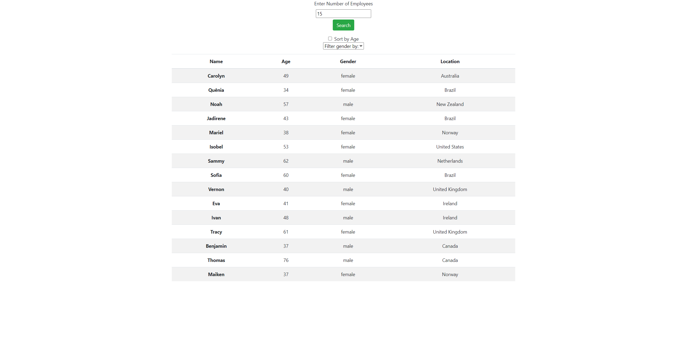

# Employee-Directory

## About the Project
Employee directory is an app to use to sort through a list of potential employees, sorting and filtering them. The app takes an inital list of employees at random, the amount specified by user, and puts them in a table. The user is able to sort by age or filter by gender.

## Installation
Run npm i to download required packages, connect to server and use the app.

## Built With
react

javascript

css

bootstrap